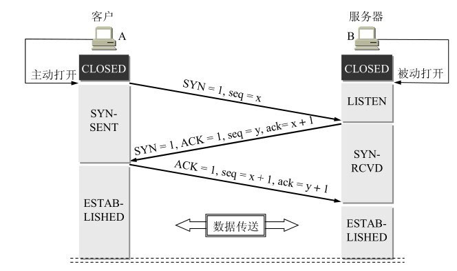

### JVM

> Java内存结构

- 程序计数器：线程私有的一块很小的内存空间，用于记录当前虚拟机正在执行的线程指令地址
- Java虚拟机栈：线程私有，每个方法被执行的时候，Java虚拟机都会同步创建一个栈帧用于存储局部变量表、操作数栈、动态链接和方法返回等信息。如果线程请求的栈深度大于虚拟机所允许的深度，将抛出StackOverFlowError异常
- 本地方法栈：线程私有，本地方法栈与虚拟机栈发挥的作用十分相似，区别是虚拟机栈为执行Java方法服务，而本地方法栈为虚拟机使用到的本地方法服务
- Java堆：Java堆是被所有线程共享的一块内存区域，在虚拟机启动时创建，几乎所有的对象实例和数组都要在堆上分配内存，该区域经常发生垃圾回收操作
- 方法区：各个线程共享的内存区域，用于存储已被虚拟机加载的类型信息（类的完整名称，类的直接父类的完整名称，类的直接实现接口的有序列表，类的修饰符）、常量、静态变量、即时编译器编译后的代码缓存等。原则上如何实现方法区属于虚拟机实现细节，不受《Java虚拟机规范》约束，在Java1.8之前，HotSpot虚拟机选择使用永久代来实现方法区，到了jdk1.8，废弃了永久代的概念，改用在本地内存中实现的元空间来代替


> 写一个stack overflow的代码

~~~java
// 递归
public void test() {
  test();
}
~~~

> 3种常量池的区分

- 字符串常量池（String Table）

  string pool中存的是引用值而不是具体的实例对象，具体对象在堆中。在HotSpot虚拟机里实现string pool功能的是StringTable，底层数据结构是HashTable

  自JDK 7起原本存放在永久代的字符串常量池被移至Java堆中，注意这时运行时常量池剩下的东西还在方法区，也就是HotSpot中的永久代

  在JDK 8中HotSpot移除了永久代用元空间取而代之，此时字符串常量池还在堆中，运行时常量池还在方法区，只不过方法区的实现从永久代变成了元空间

- Class文件常量池（Constant Pool Table）

  常量池中主要存放两大类常量：字面量（Literal）和符号引用（Symbolic References）。字面量比较接近于Java语言层面的常量概念，如文本字符串、被声明为final的常量值等；符号引用属于编译原理方面的概念，主要包括：

  - 被模块导出或开放的包
  - 类和接口的全限定名
  - 字段的名称和描述符
  - 方法的名称和描述符
  - 方法句柄和方法类型等

  在Class文件中不会保存各个方法、字段最终在内存中的布局信息，这些字段、方法的符号引用不经过虚拟机在运行期转换无法得到真正的内存地址。当虚拟机做类加载时，将会从常量池中获得对应的符号引用，再在类创建时或运行时解析、翻译到具体的内存地址中。

- 运行时常量池

  运行时常量池是方法区的一部分，Class文件常量池中存放的编译期生成的各种字面量和符号引用将在类加载后存放到运行时常量池中，此外，运行时常量池相对于Class文件常量池的另外一个重要特征是动态性，也就是说并非预置入Class文件常量池的内容才能进入方法区运行时常量池，运行期间也可以将新的常量放入池中，常用的是String类的intern()方法

> 字符串常量池（String Table）

~~~markdown
String Table特性
	1、常量池中的字符串仅是符号，第一次使用时才变为对象
	2、利用串池的机制避免重复创建字符串对象
	3、字符串变量拼接的原理是StringBuilder（1.8）
	4、字符串常量拼接的原理是编译期优化
	5、可以使用intern方法，主动将串池中还没有的字符串对象放入串池，在Java 1.8中试图将字符串对象放入串池时，如果串池中有则不会放入，没有则放入，最终将串池中的对象返回
~~~

~~~java
/**
 * 经过IDEA编译后在out文件夹下生成对应类名.class文件
 * cd到.class文件所在目录javap工具反编译，javap -v 对应类名.class
 */
public static void main(String[] args) {
    String s1 = "a";
    String s2 = "b";
    String s3 = "ab";
    // 通过字节码可以看到s4 = s1 + s2实际上执行了
    // new StringBuilder().append("a").append("b").toString()
    // toString方法执行了new String("ab")
    String s4 = s1 + s2;
    System.out.println(s3 == s4); // 打印false，因为s3在串池中，s4在堆中
    String s5 = "a" + "b"; // javac在编译期间的优化，"a"和"b"都是常量，因此"a" + "b"的结果已经在编译期间确定为ab
    System.out.println(s3 == s5); // 打印true

    String s = new String("a") + new String("b");
    String s6 = s.intern(); // 尝试将s字符串对象放入串池，如果串池中有则不会放入，没有则放入，最终将串池中的对象返回
    System.out.println(s6 == "ab"); // 打印true
    System.out.println(s == "ab");  // 打印false，因为试图将s放入串池时发现已有，故不会放入s引用的还是堆中的"ab"对象
}
~~~

> Java类加载过程

1. 加载

   在加载阶段，Java虚拟机需要完成三件事情：

- 通过一个类的全限定名获取定义此类二进制字节流
- 将这个字节流所代表的静态存储结构转化为方法区的运行时数据结构
- 在（堆）内存中生成一个代表这个类的java.lang.Class对象，作为方法区这个类的各种数据的访问入口

2. 验证

   验证的目的是确保Class文件的字节流中包含的信息符合《Java虚拟机规范》的全部约束要求，保证这些信息被当做代码运行后不会危害虚拟机自身的安全，验证阶段大致上会完成4个阶段的检验动作：

- 文件格式验证：验证字节流是否符合Class文件格式的规范，如主、次版本号是否在当前Java虚拟机接收范围之内，常量池的常量中是否有不被支持的常量类型等，此阶段基于二进制字节流进行，只有通过这个阶段的验证之后，这段字节流才被允许进入Java虚拟机内存的方法区进行存储，后续3个验证阶段全部是基于方法区的存储结构上进行的，不会再直接读取和操作字节流。
- 元数据验证：对字节码描述的信息进行语义分析，如这个类是否有父类，是否继承了不允许被继承的类等
- 字节码验证：通过数据流分析和控制流分析，确定程序语义是合法的、符合逻辑的。如方法中的类型准换是否正确，跳转指针是否正确等
- 符号引用验证：在解析阶段发生，主要目的是确保解析行为能正常执行

3. 准备

   准备阶段是为类的静态变量分配内存并将其初始化为默认值，从概念上讲，这些变量使用的内存都将在方法区中进行分配。准备阶段不分配类中的实例变量的内存，实例变量将会在对象实例化时随着对象一起分配在Java堆中

4. 解析

   该阶段主要完成符号引用到直接引用的转换，解析动作并不一定在初始化动作完成之前，也可能在初始化之后

5. 初始化

   类加载的最后一步，在之前的类加载过程中，除了在加载阶段用户应用程序可以通过自定义类加载器参与之外，其余动作完全由虚拟机主导和控制。到了初始化阶段，才开始真正执行类中编写的Java程序代码。初始化阶段就是执行类构造器`<clinit>`()方法的过程。该方法并不是程序员在Java代码中直接编写的方法，它是Javac编译器的自动生成物，由编译器自动收集类中的所有类变量的赋值动作和静态语句块（static{}块）中的语句合并产生。

6. 使用

7. 卸载

> 如何判断一个对象是否存活？

引用计数算法、可达性分析算法

**引用计数算法：**在对象中添加一个引用计数器，每当有一个地方引用它时，计数器值加一；当引用失效时，计数器值减一；当计数器值为0时对象不能再被使用，等待回收

缺点：无法解决循环引用的问题

**可达性分析算法：**通过一系列称为“GC Roots”的根对象作为起始节点集，从这些节点开始，根据引用关系向下搜索，搜索过程中走过的路径称为“引用链”，如果某个对象到GC Roots间没有任何引用链相连，证明此对象不能被使用

> 哪些对象可以作为GC Roots？

在虚拟机栈中引用的对象

在方法区中类静态属性引用的对象

在方法区中常量引用的对象，譬如字符串常量池中的引用

在本地方法栈中引用的对象

> Java中的垃圾回收算法有哪些？

标记清除、标记整理、标记复制、分代收集

**标记清除法：**首先标记出所有需要回收的对象，在标记完成后，统一回收掉所有被标记的对象

缺点：

1、执行效率不稳定，标记和清除过程的执行效率随着对象数量的增长而降低

2、内存空间的碎片化问题，标记、清除后会产生大量不连续的内存碎片，可能导致需要分配较大对象时无法找到足够的连续内存而不得不提前触发另一次垃圾收集

**标记复制法：**将可用内存按容量划分为大小相等的两块，每次只使用其中的一块，当这一块的内存用完后，将还存活着的对象复制到另一块上面，再把已使用过的内存空间一次清理掉

特点：不会产生内存碎片，但将可用内存缩小为原来的一半，存在空间浪费

**标记整理法：**标记过程仍然与“标记清除”算法一样，但后续步骤不是直接对可回收对象进行整理，而是让所有存活的对象都向内存空间一端移动，直接清理掉边界以外的内存

特点：是否移动回收后的存活对象是一项优缺点并存的风险决策，移动存活对象并更新对象引用需要“Stop The World”

**分代收集理论：** 根据内存对象的存活周期不同，将内存划分为几块，Java虚拟机一般将内存分为新生代和老年代，在新生代中有大量对象死去和少量对象存活，所以采用标记复制法；老年代中因为对象的存活率高，没有额外的空间对它进行分配担保，所以采用标记清除或标记整理算法进行回收

> CMS和G1区别

- CMS（Concurrent Mark Sweep）

CMS收集器以获取最短回收停顿时间为目标，适用于关注服务的响应速度，希望系统停顿时间尽可能短的应用。CMS收集器基于标记清除算法实现，整个过程分为4个步骤，包括

1. 初始标记：标记GC Roots能直接关联到的对象，速度很快，Stop The World
2. 并发标记：从GC Roots的直接关联对象开始遍历整个对象图，该过程耗时较长但不需要停顿用户线程
3. 重新标记：修正并发标记期间因用户程序继续运行而导致标记产生变动的那一部分对象的标记记录，Stop The World
4. 并发清除：清除标记阶段判断的已经死亡的对象，可以与用户线程同时并发

缺点：

1. 对处理器资源非常敏感

   在并发阶段，它虽然不会导致用户线程停顿，但却会因为占用了一部分线程导致应用程序变慢，降低吞吐量。CMS默认启动的回收线程数是（CPU核心数量+3）/4，当CPU核心数量不足4个时，CMS对用户程序的影响就可能变得很大。

2. 无法处理浮动垃圾

   在CMS的并发标记和并发清理阶段，用户线程还在继续运行，会伴随有新的垃圾对象不断产生，但这一部分垃圾对象时出现在标记过程结束以后，CMS无法在当次收集中处理掉它们，只好留待下一次垃圾收集时再清理掉。

3. 并发失败

   由于在垃圾回收阶段用户线程还在并发运行，就还需要预留足够的内存空间提供给用户线程使用，若预留的内存无法满足程序分配新对象的需要，就会出现一次“并发失败”，虚拟机不得不Stop The World，重新进行老年代垃圾回收，导致很长的停顿时间。

4. 内存碎片问题

- G1（Garbage First）

G1收集器的目标是在延迟可控的情况下获得尽可能高的吞吐量，可以由用户指定期望的停顿时间，采用面向局部收集的设计思路和基于Region的内存布局形式，是一款主要面向服务端应用的垃圾收集器。G1收集器的运作过程大致可分为4个步骤：

1. 初始标记：标记GC Roots能直接关联到的对象，Stop The World
2. 并发标记
3. 最终标记：Stop The World
4. 筛选回收：Stop The World

> 什么是类加载器，常见的类加载器有哪些？

类加载器是指通过一个类的全限定性类名获取该类的二进制字节流，分为以下四种：

- 启动类加载器：加载存放在%JAVA_HOME％\lib目录，能被Java虚拟机识别的类库，启动类加载器无法被Java程序直接引用
- 扩展类加载器：加载%JAVA_HOME％\lib\ext目录中所有类库
- 应用程序类加载器（系统类加载器）：负责加载用户类路径（ClassPath）上所有的类库
- 自定义类加载器：继承自ClassLoader

> 双亲委派模型？为什么需要？

当一个类加载器收到一个类加载请求，它首先不会尝试自己去加载，而是将这个请求委派给父类加载器，只有父类加载器在自己的搜索范围内查找不到该类时，子加载器才会尝试自己加载该类

为了防止内存中出现多个相同的字节码，如果没有双亲委派，用户可以自定义一个java.lang.Object类，并放在程序的ClassPath中，系统中会出现多个不同的Object类，无法保证类的唯一性，Java体系中最基础的行为也无从保证，应用程序将出现混乱。


### 多线程

> 线程是越多越好吗？

不是

- 占用内存（要分配栈内存）
- CPU同一时间只能运行有限个线程，其它线程陷入阻塞状态，会产生频繁的上下文切换

> 浏览器打开一个标签页是创建进程还是线程

进程

> Java创建线程的方式有哪些？

1、继承Thread类


2、实现Runnable接口，把线程和任务分开，Thread代表线程，Runnable代表可运行的任务


3、FutureTask配合Thread，FutureTask能够接收Callable类型的参数，用来处理有返回结果的情况


> start()和run()方法的区别

只有调用了start()方法，才会表现出多线程的特性，不同线程的run()方法里面的代码交替执行。如果只是调用run()方法，那么代码还是同步执行的，必须等待一个线程的run()方法里面的代码全部执行完毕之后，另外一个线程才可以执行其run()方法里面的代码。

> sleep/yield/join/wait/notify/park/unpark

sleep：

1、调用sleep会让当前线程从Running进入Timed Waiting状态（阻塞）

2、其它线程可以使用interrupt方法打断正在睡眠的线程，此时sleep方法会抛出InterruptedException异常

3、睡眠结束后的线程未必立即得到执行（可能CPU正在执行其它线程代码）

4、建议用TimeUnit的sleep代替Thread的sleep来获得更好的可读性

yield：

1、调用yield会让当前线程从Running进入Runnable就绪状态，然后调度执行其它线程

2、具体的实现依赖于操作系统的任务调度器（如果没有其它线程运行，可能还是当前线程运行）

线程优先级：

setPriority()

1、线程优先级会提示调度器优先调度该线程，但它仅仅是一个提示，调度器可以忽略它

2、如果cpu比较忙，那么优先级高的线程会获得更多的时间片，cpu闲时，优先级几乎没作用

join方法

**为什么需要join？**

~~~java
static int r = 0;
public static void main(String[] args) throws InterruptedException {
    test1();
}
private static void test1() throws InterruptedException {
    log.debug("开始");
    Thread t1 = new Thread(() -> {
        log.debug("开始");
        sleep(1);
        log.debug("结束");
        r = 10;
    });
    t1.start();
    // t1.join();
    log.debug("结果为:{}", r);
    log.debug("结束");
}
~~~

分析 

- 因为主线程和线程 t1 是并行执行的，t1 线程需要 1 秒之后才能算出 r=10 
- 而主线程一开始就要打印 r 的结果，所以只能打印出 r=0 

解决方法 

- 用 sleep 行不行？为什么？ 可以，但主线程无法确定t1线程执行完全部操作需要多长时间，因此无法确定等待时间
- 用 join，加在 t1.start() 之后即可

**为什么需要wait？**


- Owner 线程发现条件不满足，调用 wait 方法，即可进入 WaitSet 变为 WAITING 状态
- BLOCKED 和 WAITING 的线程都处于阻塞状态，不占用 CPU 时间片
- BLOCKED 线程会在 Owner 线程释放锁时唤醒
- WAITING 线程会在 Owner 线程调用 notify 或 notifyAll 时唤醒，但唤醒后并不意味者立刻获得锁，仍需进入 EntryList 重新竞争

API 介绍 

- obj.wait() 让进入 object 监视器的线程到 waitSet 等待 
- obj.notify() 在 object 上正在 waitSet 等待的线程中挑一个唤醒 
- obj.notifyAll() 让 object 上正在 waitSet 等待的线程全部唤醒

注意：它们都是线程之间进行协作的手段，都属于 Object 对象的方法。必须获得此对象的锁，才能调用这几个方法

~~~java
final static Object obj = new Object();
public static void main(String[] args) {
    new Thread(() -> {
        synchronized (obj) {
            log.debug("执行....");
            try {
                obj.wait(); // 让线程在obj上一直等待下去
            } catch (InterruptedException e) {
                e.printStackTrace();
            }
            log.debug("其它代码....");
        }
    }).start();
    new Thread(() -> {
        synchronized (obj) {
            log.debug("执行....");
            try {
                obj.wait(); // 让线程在obj上一直等待下去
            } catch (InterruptedException e) {
                e.printStackTrace();
            }
            log.debug("其它代码....");
        }
    }).start();
    // 主线程两秒后执行
    sleep(2);
    log.debug("唤醒 obj 上其它线程");
    synchronized (obj) {
        obj.notify(); // 唤醒obj上一个线程
        // obj.notifyAll(); // 唤醒obj上所有等待线程
    }
}
~~~

sleep(long n)和wait(long n)的区别

相同：线程都进入Timed waiting状态

1、sleep是Thread类的方法，而wait是Object类的方法

2、sleep不需要强制和synchronized配合使用，但wait需要和synchronized一起用

3、sleep在睡眠时不会释放对象锁，但wait在等待的时候会释放对象锁

wait-notify 虚假唤醒

**Park&Unpark**

基本使用

~~~java
// 暂停当前线程
LockSupport.park(); 
// 恢复某个线程的运行
LockSupport.unpark(暂停线程对象)
~~~

~~~java
// 先park再unpark
Thread t1 = new Thread(() -> {
    log.debug("start...");
    sleep(1);
    log.debug("park...");
    LockSupport.park();
    log.debug("resume...");
},"t1");
t1.start();
sleep(2);
log.debug("unpark...");
LockSupport.unpark(t1);

// 先unpark再park
Thread t1 = new Thread(() -> {
    log.debug("start...");
    sleep(2);
    log.debug("park...");
    LockSupport.park();
    log.debug("resume...");
}, "t1");
t1.start();
sleep(1);
log.debug("unpark...");
LockSupport.unpark(t1);
~~~

park与wait比较：

1、wait&notify/notifyAll必须配合Object Monitor一起使用，而park不必

2、park&unpark以线程为单位，而notify只能随机唤醒一个等待线程

3、park&unpark可以先unpark，而wait&notify不能先notify

> 固定运行顺序，线程2先打印，线程1后打印

- wait&notify

~~~java
static final Object lock = new Object();
// 表示t2是否运行过
static boolean t2Runned = false;

public static void main(String[] args) {
    Thread t1 = new Thread(() -> {
        synchronized (lock) {
            // 加while循环确保发生虚假唤醒时t1线程仍能逻辑正确
            while (!t2Runned) {
                try {
                    lock.wait();
                } catch (InterruptedException e) {
                    e.printStackTrace();
                }
            }
            log.debug("1");
        }
    }, "t1");
    Thread t2 = new Thread(() -> {
        synchronized (lock) {
            log.debug("2");
            t2Runned = true;
            lock.notify();
        }
    }, "t2");
    t1.start();
    t2.start();
}
~~~

- park&unpark

~~~java
Thread t1 = new Thread(() -> {
    LockSupport.park();
    log.debug("1");
}, "t1");
Thread t2 = new Thread(() -> {
    log.debug("2");
    LockSupport.unpark(t1);
}, "t2");
t1.start();
t2.start();
~~~

> 交替输出，线程1输出5次a，线程2输出5次b，线程3输出5次c，现在要求输出abcabcabcabcabc

- wait&notify

~~~java
public class Test10 {

    public static void main(String[] args) {
        WaitNotify wn = new WaitNotify(1, 5);
        new Thread(() -> {
            wn.print("a", 1, 2);
        }).start();
        new Thread(() -> {
            wn.print("b", 2, 3);
        }).start();
        new Thread(() -> {
            wn.print("c", 3, 1);
        }).start();
    }
}

class WaitNotify {
    // 等待标记
    private int flag;
    // 循环次数
    private int loopNum;

    public WaitNotify(int flag, int loopNum) {
        this.flag = flag;
        this.loopNum = loopNum;
    }

    public void print(String str, int waitFlag, int nextFlag) {
        for (int i = 0; i < loopNum; i++) {
            synchronized (this) {
                while (flag != waitFlag) {
                    try {
                        this.wait();
                    } catch (InterruptedException e) {
                        e.printStackTrace();
                    }
                }
                System.out.print(str);
                flag = nextFlag;
                this.notifyAll();
            }
        }
    }
}
~~~

- park&unpark

~~~java
public class Test7 {
    static Thread t1;
    static Thread t2;
    static Thread t3;

    public static void main(String[] args) throws InterruptedException {

        ParkUnpark pu = new ParkUnpark(5);
        t1 = new Thread(() -> {
            pu.print("a", t2);
        }, "t1");
        t2 = new Thread(() -> {
            pu.print("b", t3);
        }, "t2");
        t3 = new Thread(() -> {
            pu.print("c", t1);
        }, "t3");

        t1.start();
        t2.start();
        t3.start();

        Thread.sleep(1000);
        LockSupport.unpark(t1);
    }
}

/*
输出内容   下一个线程
a            t2
b            t3
c            t1
 */
class ParkUnpark{

    private int loopNumber;

    public ParkUnpark(int loopNumber) {
        this.loopNumber = loopNumber;
    }

    public void print(String str, Thread next) {
        for (int i = 0; i < loopNumber; i++) {
            // 当前线程park
            LockSupport.park();
            // 当前线程unpark后紧接着执行下一句
            System.out.print(str);
            // unpark下一线程
            LockSupport.unpark(next);
        }
    }
}
~~~

> 如何创建线程安全的单例

~~~markdown
饿汉式：类加载就会导致该单实例对象被创建
懒汉式：类加载不会导致该单实例对象被创建，而是首次使用该对象时才会创建
double check locking：
~~~

- 饿汉式（线程安全）


> volatile

Java内存模型的3个特征：

原子性：保证指令不会受到线程上下文切换的影响

可见性：保证指令不会受cpu缓存的影响

有序性：保证指令不会受cpu指令并行优化的影响

volatile（易变关键字）：保证可见性和有序性

volatile可以修饰成员变量和静态成员变量，可以避免线程从自己的工作缓存中查找变量的值，必须到主存中获取，线程操作volatile变量都是直接操作主存。synchronized也可以达到volatile的效果，既可以保证代码块的原子性，也同时保证代码块内变量的可见性，但synchronized属于重量级锁，性能相对更低，在解决可见性问题时推荐使用volatile

volatile保证在多个线程之间，一个线程对volatile变量的修改对其它线程可见，但不能保证原子性。适用于一个写线程，多个读线程的情况

**volatile原理**

volatile的底层实现原理是内存屏障，Memory Barrier

- 对volatile变量的写指令后会加入写屏障
- 对volatile变量的读指令前会加入读屏障

1 如何保证可见性

- 写屏障保证在该屏障之前的，对共享变量的改动，都同步到主存中（不只是volatile修饰的变量）
- 读屏障保证在该屏障之后的，对共享变量的读取，加载的是主存中的最新数据

2 如何保证有序性

- 写屏障会确保指令重排序时，不会将写屏障之前的代码排在写屏障之后
- 读屏障会确保指令重排序时，不会将读屏障之后的代码排在读屏障之前

3 double-checked locking 问题

```java
public final class Singleton {
    // 私有构造方法
    private Singleton(){}
    private static Singleton INSTANCE = null;
    public static Singleton getInstance() {
        if (INSTANCE == null) {
            synchronized (Singleton.class){
                if (INSTANCE == null) {
                    INSTANCE = new Singleton();
                }
            }
        }
        return INSTANCE;
    }
}
```

以上实现特点：

- 懒惰实例化：用到时才创建
- 首次使用getInstance()才使用synchronized加锁，后续使用时无需加锁

但是，很关键的一点是第一个if使用了INSTANCE变量，在同步代码块外，在多线程环境下存在问题。因为synchronized虽然能保证原子性、可见性、有序性，但是不会阻止指令的重排序，如果共享变量完全被synchronized保护，在使用过程中不会出现有序性问题

4 double-checked locking 问题解决

volatile修饰INSTANCE


> reentrantlock和synchronized区别

都支持可重入

相对于synchronized，reentrantlock具备如下特点：

- 可打断（可以被其它线程用interruput打断）
- 可以设置超时时间（不会一直等锁的释放，主动的避免死等）
- 可以设置为公平锁（其它线程释放锁时，按照在等待序列中的先进先出顺序获取锁）
- 支持多个条件变量（支持多个waitSet）

基本语法

```java
// 获取锁,放在try块内外均可
reentrantLock.lock();
try {
    // 临界区
} finally {
    // 释放锁
    reentrantLock.unlock();
}
```

**可重入**

可重入是指同一个线程如果首次获得了锁，因为它是锁的拥有者，因此有权利再次获取这把锁

如果是不可重入锁，那么第二次获得锁时，自己也会被锁挡住

**公平锁**

ReentrantLock默认是不公平的

**条件变量**

使用流程

- await 前需要获得锁
- await 执行后会释放锁，进入conditionObject等待
- await 的线程被唤醒（或打断、或超时）会重新竞争lock锁
- 竞争lock锁成功后，从await后继续执行

> ReentrantLock的实现（AQS，A代表什么，S代表什么）


> CAS

CAS（Compare and set或Compare and swap），是一条CPU原语，是一种无锁的非阻塞算法实现，CAS必须借助volatile才能读取到共享变量的最新值来实现比较并交换结果。

结合CAS和volatile可以实现无锁并发，适用于线程数少，多核CPU的场景下

> CAS的缺陷？如何解决ABA问题？

1. ABA问题

   线程仅能判断出共享变量的值与最初值A是否相同，不能感知到从A改为B又改回A的情况，此时的A已不是原来的A，数据即使修改成功，也可能有问题，可以通过AtomicStampedReference解决ABA问题，它是一个带有标记的原子引用类，通过控制变量值的版本来保证CAS的正确性

2. 循环时间长开销大

3. 只能保证一个变量的原子操作

> Happens-before原则

- 程序次序规则：在一个线程内，按照控制流顺序，书写在前面的操作先行发生于书写在后面的操作
- 管程锁定规则：一个unlock操作先行发生于后面（时间上）对同一个锁的lock操作
- volatile变量规则：对volatile变量的写操作先行发生于后面对这个变量的读操作
- 线程启动规则：Thread对象的start()方法先行发生于此线程的每一个动作
- 线程终止规则：线程中所有操作都先行发生于对此线程的终止检测
- 传递性：如果操作A先行发生于操作B，操作B先行发生于操作C，则操作A先行发生于操作C

**线程池**

> 线程池的参数有哪些？

corePoolSize：线程池的目标大小（基本大小），即在没有任务执行时线程池的大小

maximumPoolSize：表示可同时活动的线程数量上限

keepAliveTime：非核心线程的心跳时间，如果非核心线程在该时间内没有运行任务，非核心线程会消亡

workQueue：阻塞队列

handler：饱和策略

> 线程池的运行原理


> 线程池里线程的创建和销毁？核心线程可以销毁吗？

> 高并发如何减少锁的竞争？


### 集合

> 常见的集合有哪些？

Java集合类主要由两个根接口Collection和Map派生而来，Collection派生出了List、Set、Queue三个子接口

常用的实现类是ArrayList、LinkedList、HashSet、TreeSet、HashMap、HashTable、TreeMap等


> 线程安全的集合有哪些？不安全的？

线程安全：

- HashTable
- ConcurrentHashMap
- Vector
- Stack

> ArrayList 和 LinkedList的区别及使用

- 线程安全性：ArrayList 和 LinkedList都不保证线程安全
- 底层数据结构：ArrayList底层是Object数组，LinkedList（JDK1.8）底层使用的是双向链表
- 插入和删除元素：ArrayList采用数组存储，所以插入和删除元素的时间复杂度受元素位置的影响。而LinkedList不会，近似于o(1)
- 快速随机访问：LinkedList不支持高效的随机元素访问，而ArrayList实现了RandomAccess接口，支持随机访问
- 内存空间占用：ArrayList的缺点在于list列表的结尾需要预留一定的容量空间，而LinkedList的每一个元素需要消耗比ArrayList更多的空间

> ArrayList的扩容机制

ArrayList扩容的本质是计算出新的扩容数组的size后实例化，并将原有数组的内容复制到新数组。默认情况下新数组的容量是原来的1.5倍

> HashMap的底层数据结构

在jdk1.7中，由“数组+链表”组成，链表主要是为了解决哈希冲突，在jdk1.8中，由“数组+链表+红黑树”组成，引入红黑树是因为当链表过长时会严重影响HashMap的性能，红黑树的搜索时间复杂度是O(logn)，而链表是O(n)。链表和红黑树在达到一定条件是会进行转换：

- 当链表长度超过8
- 转换前会判断，如果当前数组长度小于64，那么会选择先进行数组扩容而不是转换成红黑树，以减少搜索时间

> HashMap如何解决hash冲突？为什么不直接使用红黑树？

链地址法（拉链法），将哈希值相同的元素构成一个单链表

红黑树新增节点时可能需要进行左旋、右旋、变色等操作来保持平衡，会降低新增效率。当元素数量较少时，链表结构也能保证查询性能，当元素数量较多时，链表查询性能较低，转用红黑树提高查询效率。

> HashMap的默认加载因子？为什么是0.75？

默认的loadFactor是0.75，即当容量达到3/4时进行扩容。当负载因子越大的时候能够容纳的键值对越多但查找的代价也会越高。0.75是对空间和时间效率的一个平衡选择，一般不要修改。如果内存空间很多而又对时间效率要求很高，可以降低负载因子的值；相反，如果内存空间紧张而对时间效率要求不高，可以增加负载因子的值。

> HashMap中key的存储索引如何计算？

1、首先根据key值计算出hashCode值

2、根据hashCode计算出hash值

3、hash & (length - 1)计算索引

> HashMap的put方法流程？

1、如果数组为空，调用resize方法进行初始化

2、计算数组索引值，如果该位置没有元素，直接放在对应的数组下标中，转最后一步

3、如果目标位置已有元素，判断table[i]的首个元素是否和要插入的元素key一样，如果相同（hash值相同且key值equals），则覆盖掉原来的value

4、如果hash冲突但key不存在，判断该节点的数据结构是否是红黑树，如果是就将节点挂在树上

5、如果该节点上是链表，遍历链表判断该链表的长度是否大于8，如果小于8，链表插入键值对；如果大于8将链表转为红黑树，在遍历过程中若发现key已存在，直接覆盖

6、插入成功后根据实际键值对数量是否超过threshold决定是否扩容


> HashMap的扩容方式？

HashMap在容量超过负载因子定义的容量之后就会扩容，方法是将HashMap的大小扩大为原来数组的两倍，并将原来的对象放入新数组

> 一般用什么作为HashMap的key？

一般使用Integer、String这种不可变类当HashMap的key，且String最常用

- 字符串是不可变类型，在创建时hashcode已经被缓存，不需要重新计算
- 获取对象时要用到equals()和hashCode()方法，键对象正确重写这两个方法是非常重要的，String类已经很规范的重写了两个方法

> HashMap为什么线程不安全？

- 多线程下扩容死循环：JDK1.7中的HashMap使用头插法插入元素，在多线程环境下扩容时可能导致环形链表的出现，形成死循环。JDK1.8改用尾插法插入元素，不会出现环形链表问题
- 多线程put可能导致元素丢失：多线程同时执行put操作，如果计算出来的索引位置相同，可能造成前一个key被后一个key覆盖，从而导致元素丢失
- put和get并发时可能导致get为null：线程1执行put操作，因元素个数超过阈值导致扩容操作，线程2此时执行get操作，可能获取到空值

> ConcurrentHashMap和HashMap的区别？ConcurrentHashMap的数据结构？

JDK1.8中的ConcurrentHashMap选择了与HashMap相同的数组+链表+红黑树结构，在锁的实现上抛弃了JDK1.7中采用的Segment分段锁，改用CAS+synchronized实现更加细粒度的锁，将锁的级别控制在了哈希桶元素级别，只需要锁住链表的头节点或者红黑树的根节点，不影响其他哈希桶元素的读写，大大提高了并发度。

> ConcurrentHashMap和HashTable对比

ConcurrentHashMap的效率要高于HashTable，因为HashTable使用synchronized实现线程安全，给整个hash表加了锁，多线程访问时，一个线程访问或操作该对象时，其它线程只能阻塞等待锁释放

> 红黑树

红黑树是二叉搜索树的一个分支。链表插入时十分容易，但在搜索时效率不高，于是可以使用二叉搜索树代替链表，既能保持高效的插入还能够高效查找。然而二叉搜索树在特定的情况下会退化成类似链表结构，造成效率低下，于是又产生了平衡二叉搜索树（AVL），它要求每个左右子树的高度差不超过1，要求过于严苛，导致几乎每次节点的插入和删除都会造成树结构的重组，因此产生了红黑树。

红黑树的性质：

- 根节点是黑色
- 叶子节点（NIL）是黑色
- 每个红色节点的两个子节点一定都是黑色，不能有两个红色节点相连
- 任意一节点到每个叶子节点的路径都包含数量相同的黑节点
- 如果一个节点存在黑子节点，那么该节点一定有两个子节点

插入节点必须是红色


### **Java基础**

> 8种基本数据类型

- 数值型：
  - 整数：byte/short/int/long，其中byte是字节型，占用一个字节，取值范围从-128到127
  - 浮点数：float/double，其中float是单精度浮点数，占用4个字节，double是双精度浮点数，占用8个字节
- 字符型：char
- 布尔型：boolean

> switch&case支持的数据类型

switch语句中的变量类型可以是byte、short、int或char，从Java 7 开始支持String类型，case语句中的值的数据类型必须与变量的数据类型相同

> 强引用、软引用、弱引用、虚引用？区别？

- 强引用：普通的对象引用关系
- 软引用：用于维护一些可有可无的对象，在内存空间不足时系统会回收软引用对象
- 弱引用：相对于软引用拥有更短的生命周期，当JVM进行垃圾回收时，无论内存是否充足，都会回收被弱引用关联的对象
- 虚引用：主要用来跟踪对象被垃圾回收的活动

> 重写与重载

重载和重写都是实现多态的方式，区别在于重载实现的是编译时的多态性，而重写实现的是运行时的多态性

**重写（Override）**：需要有继承关系，子类重写父类的方法！

1. 方法名必须相同，只有方法体不同
2. 参数列表必须相同
3. 修饰符：范围可以扩大但不能缩小，public>protected>default>private，即可以由private扩大为public，但不能反向
4. 抛出的异常范围可以被缩小但不能扩大，例如可以从Exception缩小为ClassNotFoundException
5. static、final修饰的方法不能重写

**重载（Overload）**：发生在同一个类中

​	1.在一个类中，同名的方法有不同的参数列表（参数类型不同、参数个数不同甚至是参数顺序不同）则视为重载。

​	2.重载对返回类型没有要求，可以相同也可以不同，不能通过返回类型是否相同来判断是否重载

>final

final变量的赋值会通过putfield指令完成，在这条指令之后会加入写屏障，保证没有指令的重排序并且在其它线程读到它的值时不会出现为0的情况
final用于修饰变量、方法和类

- final变量：被修饰的变量不可变，保证该属性是只读的，不能修改，不可变分为引用不可变和对象不可变，final指的是引用不可变
- final方法：被修饰的方法不允许任何子类重写，子类可以使用该方法
- final类：被修饰的类不能被继承（强行继承无法通过编译），所有方法不能被重写

> String、StringBuilder、StringBuffer的区别？为什么String不可变？


- 可变不可变：String类使用字符数组保存字符串，因为有final修饰符，所以String对象是不可变的（注意被final修饰的数组虽然不能指向一个新的数组，但可以修改数组的值，String的不可变性是因为String类没有提供任何一个方法去修改数组的值）；
  StringBuilder和StringBuffer都继承自AbstractStringBuilder类，在AbstractStringBuilder中也是使用字符数组保存字符串，这两种对象是可变的
- 是否线程安全：String对象是不可变的，线程安全；StringBuilder非线程安全；StringBuffer对方法加了同步锁（Synchronized），所以是线程安全的
- 效率：如果只是在单线程中使用字符串缓冲区，那么StringBuilder效率更高

> String为什么要设计成不可变的？

- 便于实现字符串常量池（设计考虑）

  在Java中会大量使用String常量，如果每一次声明一个String都创建一个String对象会造成极大的空间资源浪费，因此Java设置了字符串常量池，当初始化一个String对象时，如果字符串已在常量池中，则返回其引用。如果字符串是可变的，字符串常量池将无法实现

- 加快字符串处理速度（效率优化）

  String类型的不可变性保证了hashcode的唯一性，在创建对象时可以缓存其hashcode值，不需要重新计算，这也是hashmap常使用String作为key的原因

- 避免安全问题（安全性）

  - 多线程安全：不可变对象保证线程安全
  - 在网络连接和数据库连接中常采用字符串作为参数，其不可变性可以保证连接的安全性

> -6转换成二进制

~~~markdown
先将 -6 绝对值转换成二进制：
	0000 0000 0000 0000 0000 0000 0000 0110
求二进制反码：
	1111 1111 1111 1111 1111 1111 1111 1001
将反码加1得补码：
	1111 1111 1111 1111 1111 1111 1111 1010
~~~

> Java序列化和反序列化？为什么需要？

- 序列化：将对象转换成有序字节流，以便在网络上传输或者保存在本地文件中
- 反序列化：从文件中或网络上获得序列化后的对象字节流，根据字节流中保存的对象状态以及描述信息，通过反序列化重建对象

对内存中的对象进行持久化或网络传输，应用如RMI（Remote Method Invocation），Java对象序列化不仅保留一个对象的数据，而且递归保存对象引用的每个对象数据。

> equal和==区别，equal没有重写时默认什么？

- == : 常用于相同基本类型数据间的比较，也可以用于对象之间
  - 基本数据类型，比较值是否相等
  - 比较两个对象，比较两个对象的引用，也就是判断两个对象是否指向同一块内存区域
- equals() : 它的作用也是判断两个对象是否相等，一般有两种使用情况：
  - 类没有覆盖 equals() 方法。则通过 equals() 比较该类的两个对象时，等价于通过“==”比较这两个对象。
  - 类覆盖了 equals() 方法。一般，我们都覆盖 equals() 方法来两个对象的内容相等；若它们的内容相等，则返回 true (即，认为这两个对象相等)。

> hashCode()，equals()两种方法是什么关系

- 如果两个对象equals，Java认为它们的hashCode一定相等
- 如果两个对象不equals，它们的hashCode有可能相等
- 如果两个对象的hashCode相等，它们不一定equals
- 如果两个对象的hashCode不相等，它们一定不equals

> 为什么重写equals方法必须重写hashcode方法？

如果重写了equals方法而不重写hashcode方法，会造成hashcode的值不同而equals结果为true，违反Java规范，因为可能造成相同的对象散列到不同的位置而造成对象不能覆盖的问题

> Error和Exception的区别

Java中为了表征异常，建立了一些通用的异常类，以Throwable为父类，派生出Error和Exception两大子类

- Error及其子类代表了JVM自身的异常，发生时无法通过程序来修正，最可靠的方式是尽快停止JVM的运行
- Exception及其子类代表的异常可以被异常处理机制处理
  - RuntimeException及其子类：程序设计的错误，通过修正程序可以避免，如数组越界、数值异常等
  - 非RuntimeException及其子类：异常的发生通常由外部因素导致，不可预知和避免，如IO异常等


Error、RuntimeException两大类异常称为免检异常，即不需要对这两类异常进行强制检查。其他异常的发生与外部环境有关，称为必检异常，在编程时必须用try/catch语句包围


### 项目

>为什么使用redis存储session？

cookie存储在client，而session保存在server，sessionId是server生成的能识别用户身份信息的字符串，借助cookie进行传递

在单体服务器的情况下，session直接保存在server，是没有问题的。但随着系统用户量的增长，单体服务器已无法满足需求，通常会把系统部署在多台服务器上，通过负载均衡分配用户的请求，于是产生了session的共享问题。解决这一问题有多种方式，例如：

session复制：服务器A生成session后复制到B、C，问题在于数据冗余，节点数量大时性能消耗，以及复制过程中可能出现的延迟甚至同步失败

session粘连（IP绑定）：使用Nginx或其它方式让每个客户端请求只打到固定的一台服务器上。问题在于一台服务器宕机时会影响一批用户的使用

session共享：将session保存在redis，memcached等中间件中，请求到来时先去取一下session即可。缺点在于架构上变得复杂，且每个请求都要去redis取一下session，消耗了一点性能。但是带来了好处，实现了session共享，可以部署redis集群，服务器重启后session不丢失（但要注意设置session的失效机制），甚至可以跨平台使用

> 为什么使用token？session和token的区别

session和token都是对用户身份的认证机制，区别在于采用了不同的校验机制。session保存在server，通过在redis等中间件获取来校验。token保存在client，通过签名校验的方式来校验

对于业务量并未达到用redis程度的场景，需要一种不使用server来存储session的身份校验机制，即token，token只存储在浏览器中，server不存储，server有一套校验机制检验token是否合法，此外token中携带了用户id信息。

token一般放在header的Authorization自定义头里，不放在cookie里，主要是为了解决跨域不能共享cookie的问题

在移动端原生请求中没有cookie，而sessionid依赖于cookie，如果用token不存在此问题，因此token对移动平台支持度高，可扩展性好

> Linux强制杀死进程？参数-9是什么意思？

kill pid、kill -15 pid系统会发送一个SIGTERM信号给对应的程序，当程序接收到该signal后，可能立即停止，可能释放相应资源后停止，也可能继续运行。大部分程序接收SIGTERM信号后会先释放自己的资源，随后停止，然而当程序在等待IO时可能不会立马做出响应。

鉴于程序可能不及时响应SIGTERM，可以通过-9参数强制尽快终止一个进程


### MySQL

~~~markdown
前置知识：
1.MySQL的SQL类型
	数据定义语言 DDL：create、drop、alter，用于定义库和表结构
	数据查询语言 DQL：select，用于查询数据
	数据操纵语言 DML：insert、update、delete，对行记录进行增删改操作
	数据控制语言 DCL：grant、revoke、commit、rollback，控制数据库的权限和事务
2.MySQL两个视图概念
	一个是view，它是一个用查询语句定义的虚拟表，在调用的时候执行查询语句并生成结果。创建视图的语法是create view...，它的查询与表一样
	另一个是InnoDB在实现MVCC（多版本并发控制）时的一致性视图，即consistent read view，用于支持RC（read committed，读提交）和RR（repeatable read，可重复读）隔离级别的实现。它没有物理结构，作用是事务执行期间用来定义“我能看到什么数据”

WAL：Write-Ahead Logging
MySQL重启后生成新的binlog文件
~~~

> 数据库的三范式

**第一范式：**强调的是列的原子性，即数据库表的每一列都是不可分割的原子数据项，例如对于学生表，年级和专业可以分成两列

举例：

| 学号         | 姓名   | 年龄   | 年级专业（可再分） |
| ---------- | ---- | ---- | --------- |
| 1609030136 | 龚俊驰  | 18   | 16级信息     |

**第二范式：**

要求非主键属性完全依赖于主键，不能存在仅依赖主关键字一部分的属性（针对联合主键），例如以学号为主键时，学生表的其他字段都完全依赖学号，不能出现诸如“课程名”等不依赖学号的设计；

举例：

| 学号         | 姓名   | 年龄   | 课程名（不依赖主键） |
| ---------- | ---- | ---- | ---------- |
| 1609030136 | 龚俊驰  | 18   | 数据库原理      |

**第三范式：**非主键属性完全直接依赖主键，不能是传递依赖（任何非主属性不依赖于其它非主属性）

举例：

| 学号         | 姓名   | 年龄   | 学院        | 学院地址（间接依赖） |
| ---------- | ---- | ---- | --------- | ---------- |
| 1609030136 | 龚俊驰  | 18   | 信息与安全工程学院 | 文永楼        |

>MySQL基础架构（服务层和存储引擎层），一条SQL语句是如何执行的？


**分析器：**

如果没有命中缓存，就开始执行真正的SQL语句

- 分析器先做“词法分析”，SQL语句由多个字符串和空格组成，MySQL需要识别出里面的字符串分别是什么，代表什么
- 然后进行“语法分析”，根据此法分析的结果，语法分析器会根据语法规则，判断输入的SQL语句是否满足MySQL语法，如果不正确会提示“You have an error in your SQL syntax”

**优化器：**

经过分析器后MySQL知道要干什么，在开始执行之前还需要优化器的处理，在表里有多个索引的时候，决定使用哪个索引，或在一个语句有多表关联（join）的时候，决定各个表的连接顺序

> MySQL中的varchar和char有什么区别

char是一个定长字段，假如申请了char(10)的空间，无论实际存储多少内容，该字段都占用10个字符。而varchar是变长的，申请的只是最大长度，占用的空间为实际字符长度加一

> MySQL有哪些索引，区别？

- 普通索引：一个索引只包含单个列


- 唯一索引：索引列的值必须唯一，允许有空值

~~~markdown
普通索引和唯一索引如何选择？
	查询性能：差别不大，唯一索引的优势在于查找到第一条满足条件的记录后就会停止继续检索，而对于普通索引还需要查找下一个记录，直到碰到第一个不满足条件的记录为止。然而这一点带来的性能影响微乎其微，因为InnoDB的数据是按数据页为单位来读写的，对于普通索引来说，要多做的操作只是指针寻找和计算。
	更新过程：
	change_buffer：当需要更新一个数据页时，如果数据页在内存中就直接更新，而如果这个数据页还没有在内存中的话，在不影响数据一致性的前提下，InnoDB 会将这些更新操作缓存在 change buffer 中，这样就不需要从磁盘中读入这个数据页了。在下次查询需要访问这个数据页的时候，将数据页读入内存，然后执行 change buffer 中与这个页有关的操作。
	对于唯一索引来说，所有的更新操作都要先判断这个操作是否违反唯一性约束。比如，要插入 (4,400) 这个记录，就要先判断现在表中是否已经存在k=4的记录，而这必须要将数据页读入内存才能判断。如果都已经读入到内存了，那直接更新内存会更快，就没必要使用 change buffer了。因此，唯一索引的更新就不能使用change buffer，实际上也只有普通索引可以使用。
~~~

- 复合索引：多列值组成一个索引


> 聚簇索引与非聚簇索引

聚簇索引：数据会按照索引中的顺序进行排列和组织，索引的叶子节点存的是整行数据，例如InnoDB的主键索引

非聚簇索引（非主键索引、二级索引）：叶子节点的内容是主键的值

一个表中只能有一个聚簇索引，可以有多个非聚簇索引

MyISAM无论主键索引还是二级索引都是非聚簇索引

> MySQL索引的底层实现？MySQL索引主要使用的数据结构？

在MySQL中索引是在存储引擎层实现的，所以没有统一的索引标准，即不同存储引擎的索引的工作方式并不一样。而即使多个存储引擎支持同一种类型的索引，其底层的实现也可能不同

**FULLTEXT：**全文索引，只有MyISAM引擎支持，在char、varchar、text列上可以创建

**哈希索引：**基于哈希表实现，对于每一行数据，存储引擎对所有的索引列计算哈希码，将所有的哈希码存储在索引中，同时保存数据行的地址。哈希表结构适用于只有等值查询的场景。


**B-Tree**：B-Tree索引就是一种将索引值按一定的算法，存入一个树形的数据结构中（二叉树），每次查询都是从树的入口root开始，依次遍历node，获取leaf。B+Tree是B-Tree的改进版本，增加了顺序访问指针，每个叶子节点都指向相邻的叶子节点

**R-Tree：**仅支持geometry数据类型，优势在于范围查找

> 覆盖索引


如果执行 select * from T where k between 3 and 5，需要先读K索引树，再回到主键索引树搜索，这个过程称为”回表“，但如果执行select ID from T where k between 3 and 5，这时只需要查 ID 的值，而 ID 的值已经在 k 索引树上了，因此可以直接提供查询结果，不需要回表。也就是说，在这个查询里面，索引 k 已经“覆盖了”我们的查询需求，我们称为覆盖索引。

由于覆盖索引可以减少树的搜索次数，显著提升查询性能，所以使用覆盖索引是一个常用的**性能优化**手段。

> 最左前缀匹配原则


InnoDB采用的B+树索引结构可以利用索引的”最左前缀“来**定位记录**，好处是不再需要单独为一个不频繁的请求创建索引。

索引项是按照索引定义里面出现的字段顺序排序的。如果你要查的是所有名字第一个字是“张”的人，你的 SQL 语句的条件是"where name like '张 %'"。这时，你也能够用上这个索引，查找到第一个符合条件的记录是 ID3，然后向后遍历，直到不满足条件为止。可以看到，不只是索引的全部定义，只要满足最左前缀，就可以利用索引来加速检索。这个最左前缀可以是联合索引的最左 N 个字段，也可以是字符串索引的最左 M 个字符。

~~~markdown
在建立联合索引的时候，如何安排索引内的字段顺序?
	第一原则：如果通过调整顺序，可以少维护一个索引，那么这个顺序往往就是需要优先考虑采用的。
	第二原则：空间。比如对于市民表，既有name和age字段的联合查询，也有基于name和age单独的查询，name字段是比age字段大的，那我就建议你创建一个（name,age）的联合索引和一个（age）的单字段索引。
~~~

> 索引下推

假设执行select * from tuser where name like '张%' and age=10 and ismale=1;根据前缀索引规则找到第一个满足条件的记录ID3，在MySQL5.6之前只能从ID3开始逐个回表，到主键索引上找出数据行，再对比age字段。MySQL5.6引入了索引下推优化，可以在索引遍历过程中对索引中包含的字段先做判断，直接过滤掉不满足条件的记录，减少回表次数

> MySQL事务的特性？ACID

- Atomicity（原子性）：MySQL中包含事务的操作要么全部成功，要么全部失败回滚


- Consistency（一致性）：保证事务只能把数据库从一个有效（正确）的状态转移到另一个有效（正确）的状态


- Isolation（隔离性）


- Durability（持久性）：事务一旦提交，它对数据库中数据的改变应该是永久性的。接下来的其它操作或故障不应该对其执行结果有任何影响


> MySQL事务的4个隔离级别

- 读未提交（read uncommitted）：一个事务还没提交时，它做的变更就能被别的事务看到
- 读提交（read committed）：一个事务提交之后，它做的变更才会被其它事务看到
- 可重复读（repeatable read）：一个事务执行过程中看到的数据，总是跟这个事务在启动时看到的数据是一致的。在可重复读隔离级别下，未提交变更对其他事务也是不可见的
- 串行化（serializable）：对于同一行记录，“写”会加“写锁”，“读”会加“读锁”。当出现读写锁冲突的时候，后访问的事务必须等前一个事务执行完成才能继续执行

隔离级别由低到高是读未提交--->读提交--->可重复读--->串行化，隔离级别越高，越能保证数据的一致性，但是对并发的性能影响越大，MySQL默认的隔离级别是可重复度

| 隔离级别 | 脏读   | 不可重复读 | 幻读     |
| :--- | ---- | ----- | ------ |
| 读未提交 | Y    | Y     | Y      |
| 读提交  | N    | Y     | Y      |
| 可重复读 | N    | N     | N（间隙锁） |
| 串行化  | N    | N     | N      |

> 脏读？幻读？

**脏读：**事务 A 读取了事务 B 更新后的数据，但是事务 B 没有提交，然后事务 B 执行回滚操作，那么事务 A 读到的数据就是脏数据

**幻读：**

~~~markdown
前置条件：
	默认InnoDB引擎，事务隔离级别为可重复读，表t，select * from t where d=5 for update这个语句的意思是查所有 d=5 的行，而且使用的是当前读，并且加上写锁
	当前读：读到所有已经提交的记录的最新值
~~~

| id(primary key) | c(key) | d    |
| :-------------- | ------ | ---- |
| 0               | 0      | 0    |
| 5               | 5      | 5    |
| 10              | 10     | 10   |
| 15              | 15     | 15   |
| 20              | 20     | 20   |
| 25              | 25     | 25   |


注意这是一个**假设场景**，真实情况中由于间隙锁的存在，session B操作会阻塞。其中，Q3读到id=1这一行的**现象**，被称为**幻读**。也就是说，幻读指的是一个事务在前后两次查询同一个范围的时候，后一次查询看到了前一次查询没有看到的行。

注意：

1、在可重复读隔离级别下，普通的查询是快照读，是不会看到别的事务插入的数据的。因此，幻读在“当前读”下才会出现

2、幻读仅专指“新插入的行”，Q2也看到了Q1没看到的行，但这是当前读的特性，不能称为“幻读”

> 幻读有什么问题？

- 语义上


session B 的第二条语句 update t set c=5 where id=0，语义是“我把 id=0、d=5 这一行的 c 值，改成了 5”。由于在 T1 时刻，session A 还只是给 id=5 这一行加了行锁， 并没有给 id=0 这行加上锁。因此，session B 在 T2 时刻，是可以执行这两条 update 语句的。这样，就破坏了 session A 里 Q1 语句要锁住所有 d=5 的行的加锁声明。

- 数据一致性问题

锁的设计是为了保证数据的一致性。而这个一致性，不止是数据库内部数据状态在此刻的一致性，还包含了数据和日志在逻辑上的一致性。


现在，我们来分析一下 执行完成后，数据库里会是什么结果。

1. 经过 T1 时刻，id=5 这一行变成 (5,5,100)，当然这个结果最终是在 T6 时刻正式提交的 ;
2. 经过 T2 时刻，id=0 这一行变成 (0,5,5);
3. 经过 T4 时刻，表里面多了一行 (1,5,5);
4. 其他行跟这个执行序列无关，保持不变。

~~~mysql
id	c	d
0	5	5
1	5	5
5	5	100
10	10	10
15	15	15
~~~

这样看，这些数据也没啥问题，但是我们再来看看这时候 binlog 里面的内容。

1. T2 时刻，session B 事务提交，写入了两条语句；
2. T4 时刻，session C 事务提交，写入了两条语句；
3. T6 时刻，session A 事务提交，写入了 update t set d=100 where d=5 这条语句。

我统一放到一起的话，就是这样的：

~~~mysql
update t set d=5 where id=0; /*(0,0,5)*/
update t set c=5 where id=0; /*(0,5,5)*/

insert into t values(1,1,5); /*(1,1,5)*/
update t set c=5 where id=1; /*(1,5,5)*/

update t set d=100 where d=5;/*所有d=5的行，d改成100*/
~~~

这个语句序列，不论是拿到备库去执行，还是以后用 binlog 来克隆一个库，这三行的结果，都变成了 (0,5,100)、(1,5,100) 和 (5,5,100)。也就是说，id=0 和 id=1 这两行，发生了数据不一致。这是我们假设“select * from t where d=5 for update 这条语句只给 d=5 这一行，也就是 id=5 的这一行加锁”导致的。

> 事务的实现？

原子性、一致性、持久性通过数据库的redo log和undo log来完成。

redo log称为重做日志，用来保证事务的原子性和持久性。undo log用来保证事务的一致性。

差别：redo和undo的作用都可以视为是一种恢复操作，redo恢复提交事务修改的页操作，而undo回滚行记录到某个特定版本。因此两者记录的内容不同，redo通常是物理日志，记录的是页的物理修改操作。undo是逻辑日志，根据每行记录进行记录。

> 事务隔离的实现？


总：多版本并发控制（MVCC）

分：MySQL中每条记录在更新的时候都会记录一条回滚操作，记录上的最新值通过回滚操作，都可以得到前一个状态的值。当前值是 4，但是在查询这条记录的时候，不同时刻启动的事务会有不同的 read-view。如图中看到的，在视图 A、B、C 里面，这一个记录的值分别是 1、2、4，同一条记录在系统中可以存在多个版本，就是数据库的多版本并发控制（MVCC）。对于 read-view A，要得到 1，就必须将当前值依次执行图中所有的回滚操作得到。当系统里没有比这个回滚日志更早的 read-view 的时候，回滚日志会被删除。

> 为什么要尽量不使用长事务？

- 长事务意味着系统里面会存在很老的事务视图。由于这些事务随时可能访问数据库里面的任何数据，所以这个事务提交之前，数据库里面它可能用到的回滚记录都必须保留，这就会导致大量占用存储空间。
- 除了对回滚段的影响，长事务还占用锁资源，也可能拖垮整个库

> 什么是临时表？

MySQL在执行SQL语句时通常会临时创建一些存储中间结果集的表，临时表只对当前连接可见，在连接关闭时临时表被删除并释放所有表空间

临时表分为两种：

- 内存临时表：使用MEMORY存储引擎，数据全部放在内存中
- 磁盘临时表：使用MyISAM存储引擎

> MyISAM、InnoDB、Memory

MySQL默认支持InnoDB

- 锁粒度：InnoDB 的锁粒度为行锁、MyISAM 的锁粒度为表锁。行锁需要对每一行进行加锁，所以InnoDB锁的开销更大，但是能解决脏读和不可重复读的问题，相对来说也更容易发生死锁
- 事务：InnoDB 支持事务，MyISAM 不支持事务
- 实现B-Tree索引方式的区别：MyISAM引擎B+Tree叶节点存放的是数据记录的地址，称为“非聚簇索引”；InnoDB引擎是索引组织表，把数据放在主键索引上，称为“聚簇索引”，其他索引上保存的是主键id


> InnoDB为什么要用自增id作为主键？

如果表使用自增主键，那么每次插入新的记录，会按顺序（可能不连续）添加到当前索引节点的后续位置，当一页写满就会自动开辟一个新页。如果使用非自增主键，例如身份证、学号等，由于每次插入主键的值近乎随机，因此每次新记录都要被插入到现有索引页的某个位置，频繁的移动、分页造成了大量的碎片。

> 什么是MySQL的binlog？

binlog是记录所有数据库表结构变更以及表数据修改的二进制日志，不会记录select和show操作，binlog有3种格式，各有优缺点：

- statement：基于SQL语句的模式
- row：基于行的模式，记录的是行的变化
- mixed：混合模式

> 怎么看explain执行计划，如何理解各个字段的含义？


（1）select_type：

- SIMPLE, 表示此查询不包含 UNION 查询或子查询

- PRIMARY, 表示此查询是最外层的查询

- UNION, 表示此查询是 UNION 的第二或随后的查询

（2）type：判断查询是否高效的重要依据，可以判断此次查询是全表扫描还是索引扫描

（3）possible_keys：显示查询可能使用哪些索引

（4）key：显示MySQL实际采用哪个索引优化查询

（5）rows：MySQL查询优化器根据统计信息估算要查找到结果集需要扫描的数据行数

（6）Extra：额外信息

- Using filesort：表示MySQL不能通过索引排序达到排序效果，需要额外的排序操作，建议优化去掉
- Using index：使用覆盖索引，性能不错
- Using temporary：使用临时表，一般出现于排序，分组，多表join，查询效率不高，可以优化


### 计网

> 一次HTTP请求的过程

1、域名解析 

2、发起TCP的3次握手建立连接 

3、发起HTTP请求 

4、服务器响应HTTP请求，浏览器得到HTML代码 

5、浏览器解析HTML代码，并请求静态资源

6、页面渲染

> 详细介绍TCP的三次握手机制

~~~markdown
TCP的序号和确认号：
	32位序号seq：字节流中每个字节的序号，用来确认发送的数据有序
	32位确认号ack：TCP对上一次seq序号做出的确认号，用来响应TCP报文段，给收到的TCP报文段的序号seq加1
TCP的标志位：
	SYN：同步标志位，用于建立会话连接，同步确认号
	ACK：确认标志位，对已接收的数据包进行确认
	FIN：完成标志位，表示我已经没有数据要发送了，即将关闭连接
TCP规定SYN=1的报文段不能携带数据，但要消耗一个序号
~~~

**第一次握手：**客户端请求建立连接，向服务端发送连接请求报文，同步位SYN=1，同时选择一个随机数seq=x作为初始序列号，将该数据包发送给服务器端，发送完毕后，客户端进入SYN_SENT状态，等待服务端确认

**第二次握手：**服务端收到连接请求报文后，如果同意建立连接，则向A发送确认，则将标志位SYN和ACK都置为1，ack=x+1，同时也为自己选择一个初始序号seq=y，服务端进入SYN_RCVD状态

**第三次握手：**客户端收到服务端的确认后，还要向服务端给出确认，确认报文的标志位ACK置为1，ack=y+1，seq=x+1，将该数据包发送给服务器端，随后客户端进入ESTABLISHED状态，当服务端收到客户端的确认后也进入ESTABLISHED状态。



> TCP为什么是3次握手，可不可以只做两次握手？

1、防止已失效的连接请求报文突然又传到服务器，因而产生错误和资源浪费

正常情况：A发出连接请求，但因连接请求报文丢失而未收到确认，于是A再重传一次连接请求，收到确认，建立了连接，在数据传输完毕后释放连接。

异常情况：A发出的第一个连接请求报文段并没有丢失，而是在某些网络节点长时间滞留了，以致延误到连接释放以后的某个时间才到达，本来这是一个早已失效的报文段，但B收到后误以为是A又发出一次新的连接请求，向A发出确认报文，同意建立连接，并一直等待A发来数据，造成资源的浪费。

2、3次握手才能让双方均确认自己和对方的发送和接收能力都正常

3、告知对方自己的初始序号值，并确认收到对方的初始序号值

> TCP四次挥手关闭连接

挥手请求可以是Client端发起，也可以是Server端发起，假设是Client端发起：

**第一次挥手：**Client端发起挥手请求，将连接释放报文段首部的终止控制位FIN置为1，设置序列号seq=u，它等于前面已传送过的数据的最后一个字节的序号加1。此时Client端进入FIN_WAIT_1状态，表示Client端没有数据要发送给Server端了

**第二次挥手：**Server端收到连接释放报文后即发出确认，确认号ack=u+1，这个报文段自己的序号seq=v，v等于Server端前面已传过的数据的最后一个字节的序号加1，随后Server进入CLOSE_WAIT（关闭等待）状态。Client收到来自Server的确认后，进入FIN_WAIT_2状态，等待Server发出的连接释放报文段

*注意：*此时从客户端到服务器这个方向的连接就释放了，TCP连接处于半关闭状态，即客户端已经没有数据要发送了，但服务端若发送数据，客户端仍要接收

**第三次挥手：**若Server已经没有要向Client发送的数据，Server发出连接释放报文，FIN=1，假定此时的序号seq=w（在半关闭状态Server可能又发送了一些数据），Server还必须重复上次已发送过的确认号ack=u+1，此时Server进入LAST_ACK状态，等待Client确认

**第四次挥手：**Client收到Server的连接释放报文后必须对此发出确认，在确认报文中将ACK置为1，确认号ack=w+1，自己的序列号seq=u+1（根据TCP标准，前面Client发送的FIN报文段要消耗一个序号），然后进入TIME_WAIT状态。注意现在TCP连接还没有释放，Client必须经过时间等待计时器设置的时间2MSL后才进入CLOSED状态


> 为什么Client在TIME_WAIT状态必须等待2MSL时间？

MSL：最长报文段寿命

1、为了保证A发送的最后一个ACK报文段能到达B

这个ACK报文段有可能丢失，因而使处在LAST_ACK状态的B收不到对已发送的FIN+ACK报文段的确认。B会超时重传这个FIN+ACK报文段，而A就能在2MSL时间内收到这个重传的FIN+ACK报文，接着A重传一次确认，重新启动2MSL计时器。最后A和B都正常进入CLOSED状态。如果A在TIME_WAIT状态不等待一段时间，而是在发送完ACK报文段后立即释放连接，那么就无法接收B重传的FIN+ACK报文段，因而也不会再发一次确认报文，这样，B无法按照正常步骤进入CLOSED状态

2、保证本连接持续时间内所产生的所有报文段都从网络中消失

使下一个新的连接中不会出现旧的连接请求报文

> TCP如何保证可靠、一致、完整性？

TCP主要提供了检验和、序列号/确认应答、超时重传、滑动窗口、拥塞控制和流量控制等方法实现了可靠性传输

> HTTP报文结构

1、HTTP请求报文


HTTP请求报文的第一行叫做请求行，其后继行叫做首部行

**请求行**包含3个字段：

- 方法字段：GET、POST
- URL字段
- HTTP版本字段

**首部行**

- Host：指明了对象所在主机
- Connection：该浏览器告诉服务器不希望使用持续连接，它要求服务器在发送完被请求的对象后就关闭这条连接
- User-agent：指明用户代理，即向服务器发送请求的浏览器类型
- Accept-language：表示用户想得到该对象的语言版本
- entity body：使用GET方法时实体体为空。而使用POST方法时才使用该实体体

2、HTTP响应报文


**初始状态行**

- 协议版本
- 状态码
- 相应状态信息

**首部行**

- Connection：告诉客户，发送完报文后将关闭该TCP连接
- Date：指示服务器产生并发送该响应报文的日期和时间
- Server：指示该报文是由一台Apache Web服务器产生
- Last-Modified：指示对象创建或者最后修改的日期和时间
- Content-Length：指示了被发送对象中的字节数
- Content-Type：指示实体体中的对象是HTML文本

**实体体**

> DNS过程

~~~markdown
域名服务器的种类：
1、根域名服务器
2、顶级域名服务器
3、权限域名服务器
4、本地域名服务器
~~~

浏览器搜索自己的DNS缓存，若没有，则搜索操作系统的DNS缓存，若没有，则搜索操作系统的hosts文件；若都没有，则找TCP/IP参数中设置的首选DNS服务器，即本地DNS服务器，本地域名服务器查询自己的DNS缓存，如果没有，则进行迭代查询，先向一个根域名服务器查询，得到顶级域名服务器IP地址，向顶级域名服务器查询，得到权限域名服务器IP地址，再向权限域名服务器查询，得到查询的主机IP地址，本地域名服务器将查询结果返回

> TCP和UDP区别

两者均为运输层协议

用户数据报协议UDP（User Datagram Protocol）

- 无连接：发送数据之前不需要建立连接，减少了开销和发送数据之前的时延
- 尽最大努力交付：不保证可靠交付，因此主机不需要维持复杂的连接状态表
- 面向报文：UDP对应用层交下来的报文，既不合并，也不拆分，而是保留这些报文的边界，UDP一次交付一个完整的报文
- 没有拥塞控制
- 支持一对一，一对多，多对一，多对多交互通信
- 首部开销少

传输控制协议TCP（Transmission Control Protocol）

- 面向连接
- 每一条TCP连接只能是点对点
- 提供可靠交付
- 全双工通信：TCP允许通信双方的应用进程在任何时候都能发送数据
- 面向字节流

|       | UDP                   | TCP              |
| ----- | --------------------- | ---------------- |
| 是否连接  | 无连接（不需要先建立连接）         | 面向连接             |
| 是否可靠  | 不可靠传输，不使用流量控制和拥塞控制    | 可靠传输，使用流量控制和拥塞控制 |
| 连接对象数 | 支持一对一，一对多，多对一，多对多交互通信 | 一对一，不提供广播或多播服务   |
| 传输方式  | 面向报文                  | 面向字节流            |
| 首部开销  | 8字节                   | 最小20字节，最大60字节    |
| 适用场景  | 实时应用（视频会议，直播）         | 要求可靠传输的应用，例如文件传输 |


### Redis

> Redis的数据类型

5种常用的数据类型：

String：最常用的数据类型，适合普通的key-value存储

Hash：Hash是一个键值对集合，适合于存储对象

Set：Set是一个无序的天然去重集合

List：有序可重复集合，遵循FIFO原则，底层依赖双向链表实现

SortedSet：类似于Java中的TreeSet，是Set的可排序版，支持优先级排序，维护了一个score参数来实现

3种特殊的数据类型：

Bitmap：位图，Bitmap可以看作一个以位为单位的数组，数组中每个单元只能存0或1，数组的下标在Bitmap中叫做偏移量

Hyperloglog：HyperLogLog是用于统计基数的数据集合类型

Geospatial：主要用于存储地理位置信息


### 框架

> 工厂设计模式

```markdown
1、概念：通过工厂类，创建对象
2、好处：解耦合
	耦合：指代码间的强关联关系，一方的改变会影响到另一方，例如把接口的实现类硬编码在程序中
	UserService userService = new UserServiceImpl();
	问题：不利于代码的维护
```

> IOC（反转控制）

~~~markdown
控制：对于成员变量赋值的控制权
反转控制：把对成员变量赋值的控制权，从代码中反转（转移）到Spring工厂和配置文件中完成
好处：解耦合
底层实现：工厂设计模式
~~~

> 依赖注入（Dependency Injection DI）

~~~markdown
注入：通过Spring工厂及配置文件，为对象的成员变量赋值
依赖注入：当一个类需要另一个类时，就出现了依赖关系，一旦出现依赖，就可以把另一个类作为本类的成员变量，通过Spring配置文件进行注入
好处：解耦合
~~~

> AOP

~~~markdown
AOP（Aspect Oriented Programing） 面向切面编程=Spring动态代理开发
以切面为基本单位的程序开发，通过切面间的彼此协同，相互调用，完成程序的构建
本质是Spring动态代理开发，通过代理类为原始类增加额外功能
好处：利于原始类的维护
~~~

> AOP的底层实现原理

- 核心问题

1、AOP如何创建动态代理类（动态字节码技术）

代理创建的3个要素：原始对象，额外功能，代理对象和原始对象实现相同的接口

- JDK动态代理：通过接口创建代理的实现类

~~~java
Proxy.newProxyInstance(classLoader, interfaces, invocationHandler);
~~~

- CGlib动态代理：通过继承父类创建代理类

~~~java
Enhancer enhancer = new Enhancer();
enhancer.setClassLoader();
enhancer.setSuperClass();
enhancer.setCallback(new MethodInterceptor(){})
enhancer.create();
~~~

2、Spring工厂如何加工创建代理对象（通过原始对象的id值，获得的是代理对象）

通过实现BeanPostProcessor的postProcessAfterInitialization()方法

> SpringBoot的优点

- 独立运行：SpringBoot内嵌了各种servlet容器，Tomcat、Jetty等，不需要打成war包部署到容器中，只需要打包成一个可执行的jar包就能独立运行
- 简化配置：spring-boot-starter-web启动器自动依赖其他组件，简化了maven的配置
- 无代码生成和XML配置
- 应用监控


### 算法题

#### 0 储备

- [x] 快排、归并排序、堆排序
- [x] 二叉树的前中后序遍历（递归&非递归）

#### 1 二叉树

- [x] 剑指 Offer 54. 二叉搜索树的第k大节点（递归&非递归）

#### 2 数组

- [x] 剑指 Offer 42. 连续子数组的最大和（暴力解n^3—>优化n^2—>动态规划n，注意数据长度为1的情况）
- [x] 剑指 Offer 51. 数组中的逆序对（归并排序密切相关，如果用if(l == r)的递归终止条件，需要单独处理空数组的情况）
- [x] 剑指 Offer 04. 二维数组中的查找（不从下标为[0,0]的位置开始查找，一次性排除一列或一行）
- [ ] 剑指 Offer 29. 顺时针打印矩阵

#### 3 链表

- [ ] 剑指 Offer 52. 两个链表的第一个公共节点
- [ ] 剑指 Offer 35. 复杂链表的复制（随机链表复制）